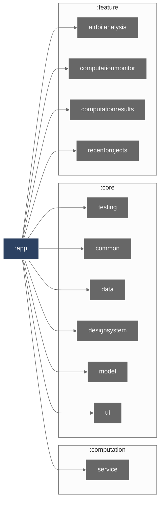

### Module Graph

```mermaid
%%{
  init: {
    'theme': 'neutral'
  }
}%%

graph LR
  subgraph :computation
    :computation:service["service"]
  end
  subgraph :core
    :core:testing["testing"]
    :core:common["common"]
    :core:data["data"]
    :core:designsystem["designsystem"]
    :core:model["model"]
    :core:ui["ui"]
  end
  subgraph :feature
    :feature:airfoilanalysis["airfoilanalysis"]
    :feature:computationmonitor["computationmonitor"]
    :feature:computationresults["computationresults"]
    :feature:recentprojects["recentprojects"]
  end
  :app --> :core:testing
  :app --> :computation:service
  :app --> :core:common
  :app --> :core:data
  :app --> :core:designsystem
  :app --> :core:model
  :app --> :core:ui
  :app --> :feature:airfoilanalysis
  :app --> :feature:computationmonitor
  :app --> :feature:computationresults
  :app --> :feature:recentprojects

classDef android-application fill:#2C4162,stroke:#fff,stroke-width:2px,color:#fff;
classDef unknown fill:#676767,stroke:#fff,stroke-width:2px,color:#fff;
class :app android-application
class :core:testing unknown
class :computation:service unknown
class :core:common unknown
class :core:data unknown
class :core:designsystem unknown
class :core:model unknown
class :core:ui unknown
class :feature:airfoilanalysis unknown
class :feature:computationmonitor unknown
class :feature:computationresults unknown
class :feature:recentprojects unknown

```