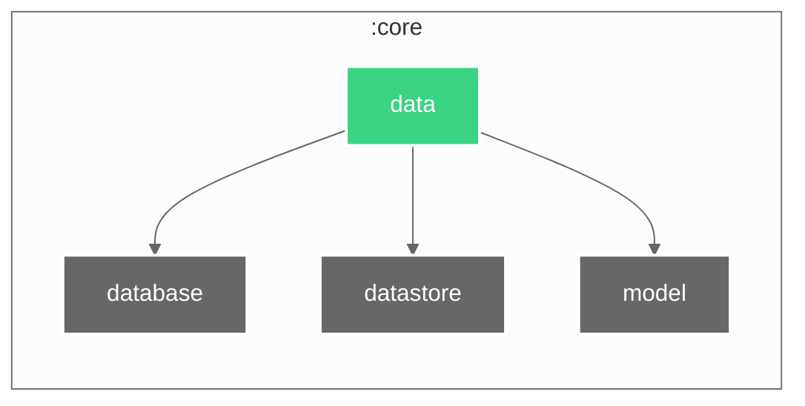

### Module Graph

```mermaid
%%{
  init: {
    'theme': 'neutral'
  }
}%%

graph LR
  subgraph :core
    :core:data["data"]
    :core:database["database"]
    :core:datastore["datastore"]
    :core:model["model"]
  end
  :core:data --> :core:database
  :core:data --> :core:datastore
  :core:data --> :core:model

classDef android-library fill:#3BD482,stroke:#fff,stroke-width:2px,color:#fff;
classDef unknown fill:#676767,stroke:#fff,stroke-width:2px,color:#fff;
class :core:data android-library
class :core:database unknown
class :core:datastore unknown
class :core:model unknown

```