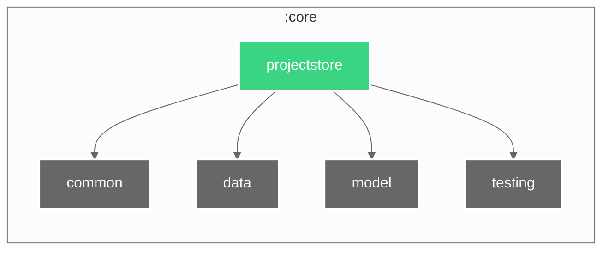

### Module Graph

```mermaid
%%{
  init: {
    'theme': 'neutral'
  }
}%%

graph LR
  subgraph :core
    :core:projectstore["projectstore"]
    :core:common["common"]
    :core:data["data"]
    :core:model["model"]
    :core:testing["testing"]
  end
  :core:projectstore --> :core:common
  :core:projectstore --> :core:data
  :core:projectstore --> :core:model
  :core:projectstore --> :core:testing

classDef android-library fill:#3BD482,stroke:#fff,stroke-width:2px,color:#fff;
classDef unknown fill:#676767,stroke:#fff,stroke-width:2px,color:#fff;
class :core:projectstore android-library
class :core:common unknown
class :core:data unknown
class :core:model unknown
class :core:testing unknown

```