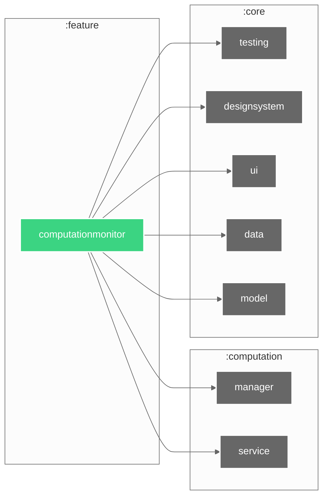

### Module Graph

```mermaid
%%{
  init: {
    'theme': 'neutral'
  }
}%%

graph LR
  subgraph :computation
    :computation:manager["manager"]
    :computation:service["service"]
  end
  subgraph :core
    :core:testing["testing"]
    :core:designsystem["designsystem"]
    :core:ui["ui"]
    :core:data["data"]
    :core:model["model"]
  end
  subgraph :feature
    :feature:computationmonitor["computationmonitor"]
  end
  :feature:computationmonitor --> :core:testing
  :feature:computationmonitor --> :core:designsystem
  :feature:computationmonitor --> :core:ui
  :feature:computationmonitor --> :computation:manager
  :feature:computationmonitor --> :computation:service
  :feature:computationmonitor --> :core:data
  :feature:computationmonitor --> :core:model

classDef android-library fill:#3BD482,stroke:#fff,stroke-width:2px,color:#fff;
classDef unknown fill:#676767,stroke:#fff,stroke-width:2px,color:#fff;
class :feature:computationmonitor android-library
class :core:testing unknown
class :core:designsystem unknown
class :core:ui unknown
class :computation:manager unknown
class :computation:service unknown
class :core:data unknown
class :core:model unknown

```