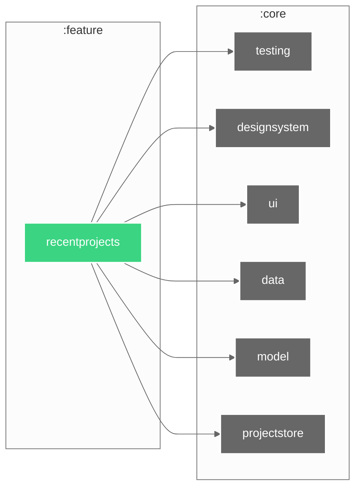

### Module Graph

```mermaid
%%{
  init: {
    'theme': 'neutral'
  }
}%%

graph LR
  subgraph :core
    :core:testing["testing"]
    :core:designsystem["designsystem"]
    :core:ui["ui"]
    :core:data["data"]
    :core:model["model"]
    :core:projectstore["projectstore"]
  end
  subgraph :feature
    :feature:recentprojects["recentprojects"]
  end
  :feature:recentprojects --> :core:testing
  :feature:recentprojects --> :core:designsystem
  :feature:recentprojects --> :core:ui
  :feature:recentprojects --> :core:data
  :feature:recentprojects --> :core:model
  :feature:recentprojects --> :core:projectstore

classDef android-library fill:#3BD482,stroke:#fff,stroke-width:2px,color:#fff;
classDef unknown fill:#676767,stroke:#fff,stroke-width:2px,color:#fff;
class :feature:recentprojects android-library
class :core:testing unknown
class :core:designsystem unknown
class :core:ui unknown
class :core:data unknown
class :core:model unknown
class :core:projectstore unknown

```